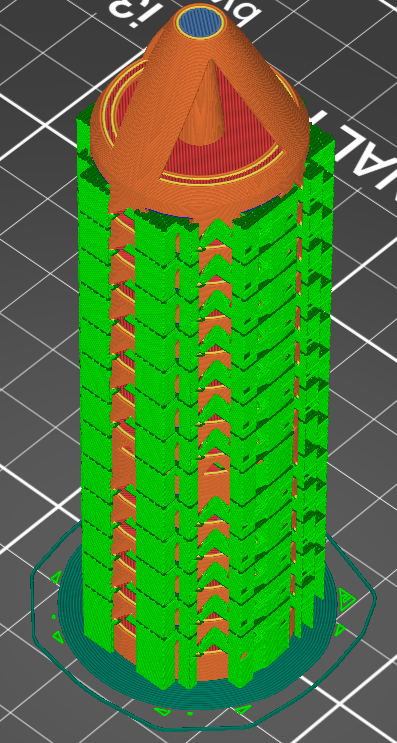

- [Introductions](#introductions)
- [Slicing](#slicing)
- [Summary](#summary-assignment-requirements)

## Introductions
Now that I've made a SolidWorks assembly for the syringe scaffold from [F1](juicedtin.github.io/bme66/F1), I can try to 3D print it from an STL file! This is a relatively short assignment documentation-wise, since there's not a whole lot of design required.

## Slicing
All 3D printers operate off of GCode, which tells it what to deposit, where to deposit it, at what time to deposit it, what supports are required, etc. Because I'll be using PRUSA printers for this type of thing, I decided to use the open-source [PrusaSlicer](https://github.com/prusa3d/PrusaSlicer/releases) for this. After exporting my assembly in STL form, I imported it into the PrusaSlicer program.

Note that SolidWorks can export either the entire assembly or each file separately. Distinguishing from this is a weird file setting in options (thanks Tracy for pointing out this issue) at the Save As screen. 
{: .notice}

I used a gyroid infill - PrusaSlicer recommended this for most prints, as it's both structurally sound and quick to print. Because I'm intending for this to go into a centrifuge at a hefty 9000G, I was worried about strength, so I increased the perimeters to 2 (the printer will double-line all the boundaries, increasing strength). If it ends up getting crushed in the centrifuge, I'll probably up this number further and change the infill to honeycomb - but as this is my first run, I wanted to cut down on printing time.

I used the default values for everything else, checking "generate supports" and "brim" to increase stability and smooth the filament-printing process and increase the stability of the model as much as possible. However, I ran into some issues (left side)

| First Slicing Attempt |  Second Slicing Attempt |
|:-------------------------:|:-------------------------:|
 | 

Quite a lot of supports. I diagnosed that this is probably due to how thin and tall the model is - so I tried to fiddle with the settings and used a "Snug" support structure, along with only building supports on the build plate instead.Although the "snug" support structure is theoretically less stable for tall and thin structures, it decreased the printing time significantly to approx. 4:24 (which is still a while, but not the 7 hours of the previous iteration). 

I send this print into Ender - but I realized that I made a mistake when it came to cloud saving, as the brim/skirt that I intended in these slices didn't translate through Box (I think I might have forgotten to save the correct version). Regardless, here are some photos of the entire process: 

| Initial Layers | Finished Print | Removed From Printbed |
|:-----:|:-----:| :-----: |
 |  | 

<!--
And, because GIFs are cool, I also took a video of the printing processs to document how the infill (gyroid) and perimeter settings ended up printing (right).-->

## Summary (Assignment Requirements) 

In summary, I printed the SolidWorks CAD model that I made in [F1](juicedtin.github.io/bme66/F1) using black PLA filament on an Ender printer. I found difficulty when optimizing supports to determine specifically what was required - I was concerned about the line between print time/material usage and structural integrity of the print itself. 

It's notable that fused deposition modeling (FDM) 3D printers like the Enders and the Prusas are more suited to fabrication of complex and detailed patterns in an additive fashion (like the triangles in this print). Traditional technologies would require creating two halves of a mold via subtractive fabrication before injection molding the plastic. However, the more complex the pattern, the smaller the margin of error in the matching of the two halves. Upon injection molding of the plastic, it could be possible that small details would be lost in "noise" or excess plastic from mold imperfections. Furthermore, subtractive manufacturing could have larger issues in fabricating hollow objects - any errors in tolerances of the CNC machinery could lead to structural issues with the object, while supports significantly ease this burden in additive manufacturing. Finally, and most obviously, processes for additive manufacturing are usually cheaper and faster (including CAD, procurement of materials, etc.), allowing for  rapid prototyping at relatively high precision before moving further to more robust materials where subtractive fabrication may be necessary. 