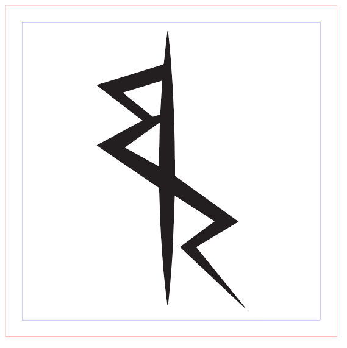
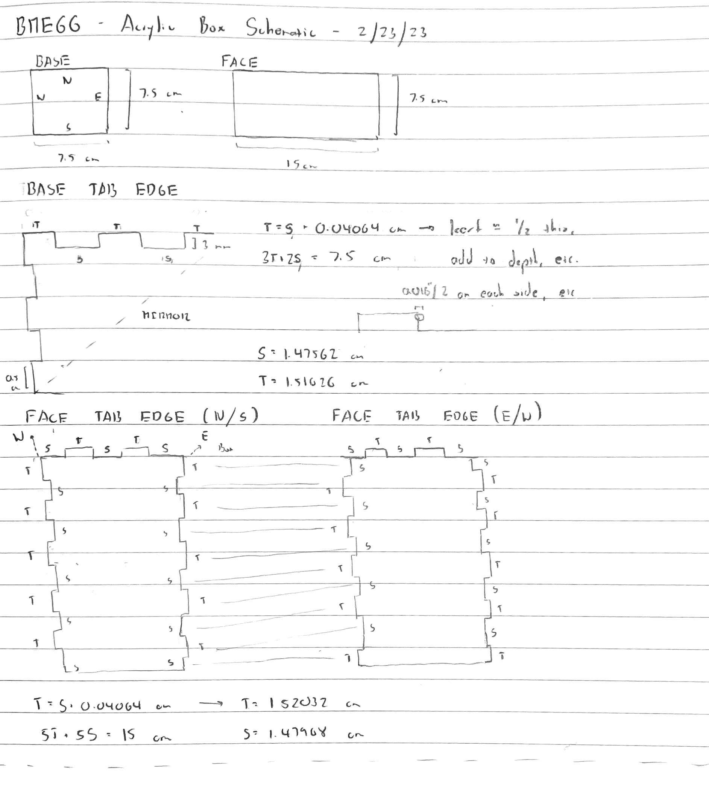
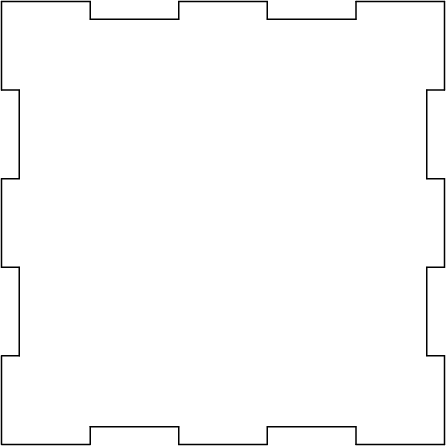
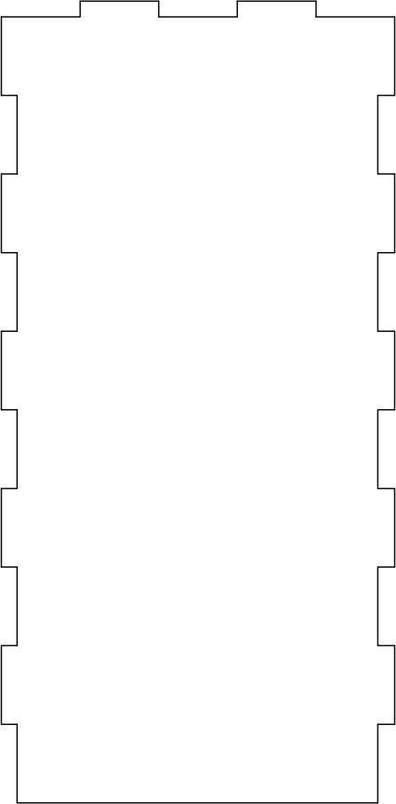
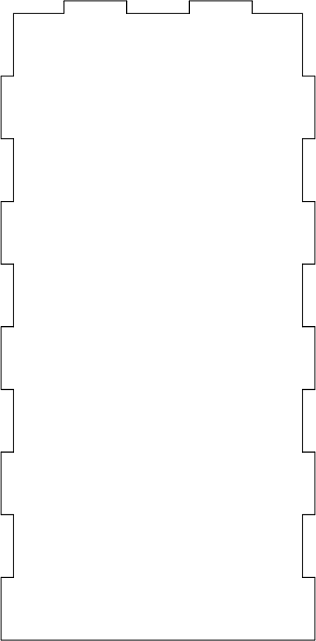
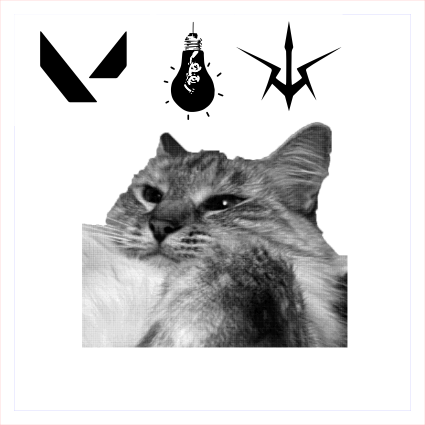

- [Introductions](#introductions)
- [Pattern and Kerf (Nolop)](#pattern-and-kerf-nolop)
- [SolidWorks Sketch](#solidworks-sketch)
- [Wood TestRun](#wood-testrun)
- [Bray, Acrylic](#bray-acrylic)
- [Summary (Assignment Requirements)](#summary-assignment-requirements)

## Introductions

Laser cutting is great for making gifts, so I figured I'd make a gift for one of my friends in the form of a pencil holder/cup/whatchamacallit. I also thought that making something like this would be a good way to get into 3D rapid prototyping via laser cutting, since 2D machining is a little easier on harder materials like acrylic and metal if I wanted to use the waterjet, etc. It's also nice that it's much easier to print patterns, and Illustrator has an easy "image trace" function that let me yoink paths and images from random logos and icons I found online.

## Pattern and Kerf (Nolop)

When I first started working on this project, I wasn't sure if I would be able to do my fabrication on the Bray machines - so I decided to do a Nolop test run to take a look at how different patterns come out on frosted acrylic and to note the relevant kerf for that laser cutter.

|                                           Illustrator 2D Vector Drawing                                           |                                  Cut Product                                  |
| :---------------------------------------------------------------------------------------------------------------: | :---------------------------------------------------------------------------: |
|  |  |

Although this wasn't that useful in the end, I did measure out a kerf of approximately `0.195mm` that might be useful for me or others who wish to cut on the Nolop machine later on.

## SolidWorks Sketch

After doing some drawings on paper to make sure I was getting my design straight (right)
To make sure I'm not going insane when it comes to matching tabs and slots, I decided to make the box entirely in SolidWorks, then add kerf compensation, etc. after exporting to DXF to make my life easier. I won't bore you with all of the sketch documentation - it was essentially the same process as in [F1](juicedtin.github.io/bme66/f1), and the final product looks something like this:

I exported these to DXFs using SolidWorks (making sure to specify the plane I was exporting to):

|                                            Base DXF                                            |                                               North/South Face DXFs                                               |                                       East/West Face DXFs                                        |
| :--------------------------------------------------------------------------------------------: | :---------------------------------------------------------------------------------------------------------------: | :----------------------------------------------------------------------------------------------: |
|  |  |  |

And now I have my Illustrator files, ready for some cool designs to be plastered on them via image trace!

## Wood TestRun

First things first, I don't want to use the _precious_ frosted acrylic considering how expensive it is - so I decided to do a wood testrun in Nolop over the weekend before my Bray "actual" run. Which means I need to figure out how to deal with kerf.

Since one of my high-school friends has a cat (best cat in all of the animal kingdom, I will _try_ to fight those who disagree), I decided to play around with the test print and figure out what it would look like if you plastered Lilac's face via bitmap and raster. I made the square 5 cm by 5 cm, so that I could measure the amount that got blasted off from the outside.

|                                             Illustrator 2D Vector Drawing                                             |                                                 Cut Product                                                 |
| :-------------------------------------------------------------------------------------------------------------------: | :---------------------------------------------------------------------------------------------------------: |
|  |  |

Looks like Lilac got a little mangled in the engraving - bitmap doesn't translate brightness super well into wood. Good thing my target symbols up above came out relatively well, though!

The total height of the square was 0.38 mm less than predicted - thus, since the kerf is equally split across the cutting line, the full kerf is `0.38mm`. However, I'm only offsetting my lines in Illustrator to one side - so the offset amount is `0.195 mm`, which checks out to be almost exactly the same as acrylic (interesting, I thought it would be slightly wider).

Putting everything into Illustrator (all 5 faces and the patterns, along with some etched frames), I use the Offset Path tool to push out all of my current lines by 0.195 mm to get this as my final cut that I sent into Nolop. Note that I used image trace to get the icons from my original images into a grayscale vector form, which gave me:

and after cutting:

Issues here - although I think I was fortunate that the scale transferred between the original Illustrator files, I think I should have been more carefeul with checking the scale, since the units did change halfway through and I'm surprised that it came out as well as it did. Also, I printed the engravings/rastering upside down. Whoops! However, I verified that my kerf compensation was correct, as all the tabs fit into their slots tightly.

Considering that I flipped the images, I opted to not bond these togehter and wait until the actual Bray run.

## Bray, Acrylic

After flipping the images and fixing the kerf back to normal, I decided to go to Bray: partly to get trained on their cool-er laser cutter, and partly to cut this thing! One hour, a bunch of superglued fingers, and some clear-blue acrylic later, I was able to put this together:

A couple of issues - I figured out that supergluing the box together was difficult, since the box faces were so thin that they couldn't stand up alone. I had to glue essentially 2 faces and the base together at once to get everything to stick. Furthermore, I made a units oopsie: the Bray acrylic sheets were 1/4 in, but my slots were designed for 3 mm, or approx. 1/6 in. Although it was close enough to get most of the assembly to fit and be glued together, there are a few tolerance gaps near the corners. Looks like I'll be back in here sooner or later!

## Summary (Assignment Requirements)

In summary, I created a box out of acrylic with engraved patterns on each side. To do this, I used the Bray Trotec Speedy 400 120-Watt CO2 Laser, along with a 1/4-in piece of clear blue-tinted acrylic. As I mentioned, compensating for kerf and assembly of the final box were the most difficult, but I still had a lot of fun!

I've realized that in a lot of cases, laser cutting is probably better than conventional 3D printing if you're working with exceptionally thin faces and pieces. It's not only much faster, but has a higher degree of precision (considering the issues with supports, etc.) for the length of time it takes to prototype. Furthermore, it's able to engrave patterns and other images in a way that 3D printing can't do as effectively (and at much higher speed). On the other end of the spectrum, 3D subtractive machining (CNC/milling, etc.) seems wasteful for a project like this one (thin-faced box) - its much easier to break down the general object into pieces and build them back up via assembly and bonding. This reduces the waste that would arise from 3D machining a giant block while still maintaining precision and relative ease of design (SolidWorks/Illustrator/etc.).
