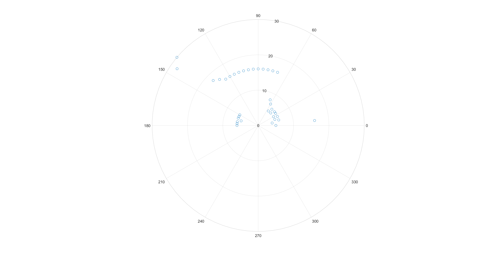

- [Introductions](#introductions)
- [Code and Simulation](#code-and-simulation)
- [Prototyping](#prototyping)
- [MATLAB Plotting](#matlab-plotting)
- [Summary (Assignment Requirements)](#summary-assignment-requirements)

## Introductions

Tasked with making _anything_ with an ELEGOO Super Starter Kit, I did some Reddit-diving. A lot of people have made a lot of interesting things: I was thinking about a light-sensitive motor pointer, or maybe something with humidity and temperature. However, I wanted to integrate multiple sensors together, so I got the idea to make a sonar module! 

Essentially, I can slap an ultrasonic sensor on a a servo, rotate it every degree or so (I'll probably have to tweak the resolution) and take distance measurements. Then I can port this into a polar plotter and make a 180-degree "distance map" that should roughly approximate the surroundings of my device. To make something like this, I obviously needed actuation control and distance control - I used the servo here to execute exact angle measurements, and the ultrasonic sensor to measure distance.

## Code and Simulation

After some Googling, I realized that it's actually possible to completely simulate the circuit and Arduino module without ever building everything (which should probably save me a lot of time). I used [TinkerCad](https://www.tinkercad.com/dashboard) to build and simulate my code. This is the initial setup with labeled pins:


To summarize, I essentially created a power and ground channel on the breadboard to support anything else I might want to add to the circuit later. I connected the ultrasonic and servo power/ground pins to these channels, and fed the power channel with the 5V power output from the UNO R3 and the GND pin as demonstrated. I also hooked up the signal line of the servo to pin 3, the trigger line of the ultrasonic to pin 5, and the echo line of the ultrasonic to pin 6. Relatively straightforward!

As for the code, it's relatively short, so I'll attach it here:
```
#include <Servo.h>
Servo uSweeper;  //Instantiate servo

//Create variables for all pins
int USEchoPin = 5;
int USTrigPin = 6;
int servoPin = 3;

void setup() {
  uSweeper.attach(servoPin);   //Attach DIGPin3 to servo object
  Serial.begin(9600);          //Serial for debugging
  pinMode(USTrigPin, OUTPUT);  //Set pinout modes for US
  pinMode(USEchoPin, INPUT);
  pinMode(LED_BUILTIN, OUTPUT);
}

// Public function that inputs the pin for the trigger and echo pins
// of the ultrasonic component, and outputs a distance long in cm.
long usDist(int trigPin, int echoPin) {
  //Send out US pulse (triggered by HIGH for 10 useconds)
  digitalWrite(trigPin, LOW);
  delayMicroseconds(10);
  digitalWrite(trigPin, HIGH);
  delayMicroseconds(5);
  digitalWrite(trigPin, LOW);
  long waveDur = pulseIn(echoPin, HIGH);
  long dist = waveDur / 29 / 2;
  delay(100);
  return dist;
}

void loop() {
  for (int ang = 0; ang < 180; ang += 5) {
    //uSweeper.write(ang); //Turn servo to this angle
    delayMicroseconds(150);  //Wait for servo to move
    long angleDist = usDist(USTrigPin, USEchoPin);  //Get distance
    Serial.print(angleDist);
    Serial.write(13);
    Serial.write(10);
    delay(250);
  }
  //Signify completion of one sonar loop

  digitalWrite(LED_BUILTIN, HIGH);
  delayMicroseconds(200);
  digitalWrite(LED_BUILTIN, LOW);
  //Print array
}
  ```

The comments provide a bit more detail as to what each line is doing - but overall, the code essentially does an ultrasonic sensor read, then prints this distance into the Serial out (which I'll feed into the serial port). It then advances the servo motor forwards by 1 degree, and does it again. Repeat until 180 degrees has been achieved, blink an LED to signify that we're done with a loop, then repeat! 

TinkerCad also lets you simulate your code, which is really helpful to be able to debug without messing with the actual Arduino parts. I still had to figure out a way to get the data onto an actual "graph" such that it's readable, but I wanted to build and test this initial prototype, as graphing the data (probably by reading the serial port) is mostly software-based. 

## Prototyping

The circuit didn't come out nearly as cleanly as the schematic mentioned, but wiring everything up creates something like this:


And when I attach the servo to the motor with copious amounts of tape and run the code...

From this, I really learned the importance of proper breadboard and circuit management - it was really easy to get pins mixed up, and I found wiring `VCC` and `GND` to the vertical breadboard rails simplified wiring by a lot. 
## MATLAB Plotting

Turns out, the MATLAB plotting was the hardest part. I ended up taking an example from one of their documentation examples for this part. Code follows:
```
arduino = serialport("COM3", 9600);
configureTerminator(arduino, "CR/LF");
flush(arduino)
arduino.UserData = struct("Distance",[], "Angle", []);
configureCallback(arduino,"terminator",@readSonar);

function readSonar(src, ~)

% Read the ASCII data from the serialport object, add the first angle
% value. 
data = readline(src);
src.UserData.Angle(1) = 0;

% Convert the string data to numeric type and save it in the UserData
% property of the serialport object. Tack on the angle value onto the other
% side of the stuct
src.UserData.Angle(end+1) = src.UserData.Angle(end) + 5;
src.UserData.Distance(end+1) = str2double(data);
src.UserData

% If full cycle of data points have been collected from the Arduino, reset
% structs, plot data
if src.UserData.Angle(end) == 180
    src.UserData.Distance(end+1) = str2double(data);
    figure(1)
    polarscatter(src.UserData.Angle*pi/180,src.UserData.Distance);
    src.UserData.Distance = [];
    src.UserData.Angle = [];
end
end
```
Again, comments are relatively self-explanatory. I had a lot of issues trying to set this up initially, since it turns out that MATLAB serial reads operate a lot differently that I was expecting. There's actually no `while` loop present here - once you run the code, the `configureCallback` governs the entire function: 

It turns out that MATLAB will continue to read data from the serial port as long as `terminator` is configured as such. Turning this to `off` stops the serial read.

{: .notice}

 Also, don't forget to convert degrees to radians (I didn't initially), since the servo operates on degrees, but MATLAB `polarscatter` operates on radians. Put this all together, and you get:



Looks pretty awesome! I put a book in front of the sensor, so that's what the line of dots reds. There's a few issues with false long-distance reads, probably due to a mismatch between trigger and echo positions and respective obstacles. Not bad!

## Summary (Assignment Requirements)


